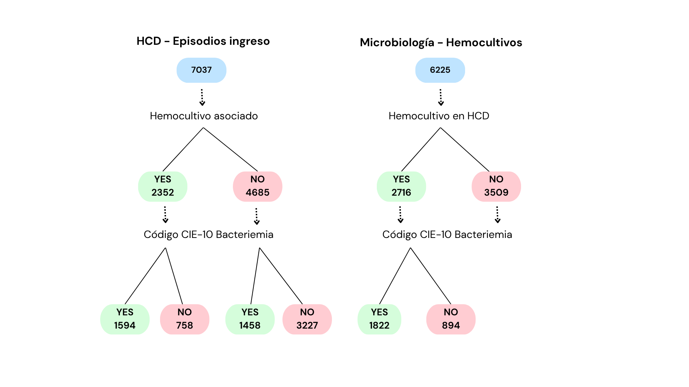

# BactHeCom Platform - Project Overview

## 1. Project Description

**BactHeCom** is a hospital-based data platform designed to process, analyze, and generate predictive models using clinical and textual data from Electronic Health Records (EHR/HCE). The platform aims to support clinical decision-making through predictive analytics and alerts while maintaining on-premise deployment for hospital-specific environments. Future development contemplates a federated architecture to enable multi-center data sharing.



The project is divided into two main phases:

1. **Retrospective Data Analysis and Model Development**

   - Capture historical clinical data and unstructured text (using NLP) from hospital EHRs.
   - Extract, normalize, and store variables in a central repository.
   - Develop predictive models for clinical events.
   - Pilot models in hospital environments to validate and refine predictive accuracy.
2. **Real-Time Model Execution and Alerts**

   - Once validated, models can generate real-time alerts during patient care.
   - Integration with hospital systems for automatic or semi-automatic execution.
   - Support clinical decision-making while minimizing bias and errors.

The platform will have a **web-based frontend** for clinical users to interact with data, review results, and visualize predictive outputs.

---

## 2. Data Flow and Processing

### 2.1 Data Sources

- EHR/HCE data from participating hospitals.
- Structured data: demographics, lab results, medications, procedures.
- Unstructured data: clinical notes, pathology reports (processed via NLP).

### 2.2 Data Extraction & Normalization

- Extract relevant variables for retrospective analysis.
- Normalize variables according to **MePRAM model**.
- Ensure compatibility with ISCIII standards for centralized inclusion.
- Manual verification of labels and NLP refinement to reach target precision.

### 2.3 Predictive Model Development

- Retrospective training using pilot tool.
- Iterative evaluation and fine-tuning.
- Validation in multiple hospital environments.
- Approximation to production environment through pilot tests.

### 2.4 Real-Time Execution (Future Phase)

- Model execution triggered at patient encounter.
- Integration with hospital alert systems.
- Potential for automated or semi-automated decision support.

---

## 3. Frontend and Portal Features

- Web-based interface for clinicians:
  - Visual dashboards of patient-level and aggregate results.
  - Alert notifications based on predictive model outputs.
  - Access to retrospective study results and model performance metrics.
- Data transfer and centralization tools to monitor repository updates.
- Manual or automated workflows for feeding normalized data into the system.

---

## 4. Architecture Overview

```text
+---------------------+          +--------------------+         +------------------+
| Hospital EHR/HCE    |  --->    | Data Extraction    |  --->   | Central Repository|
| (Structured & NLP)  |          | & Normalization    |         | & Model Storage  |
+---------------------+          +--------------------+         +------------------+
        |                             |                                 |
        |                             v                                 |
        |                      Model Training &                         |
        |                      Predictive Analytics                     |
        |                             |                                 |
        |                             v                                 |
        |                        Web Frontend                            |
        |                   (Dashboards, Alerts)                        |
        +---------------------------------------------------------------+
```
